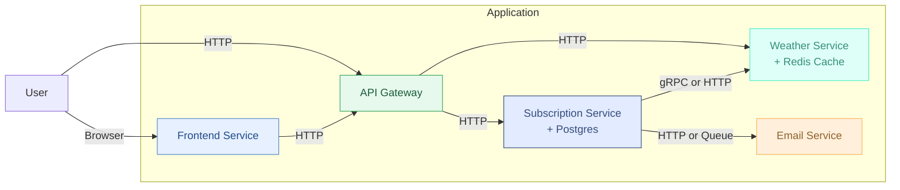

## 4. Пропозиція B

Альтернативний варіант архітектурного переходу з фокусом на спрощення структури, зменшення кількості внутрішніх компонентів та винесення публічного інтерфейсу в окремий сервіс.

### Принципи

- Зменшення інфраструктурної складності.
- Відмова від воркерів та черг у базовому варіанті (можливість додати згодом).
- Винесення UI у окремий сервіс з прямим доступом до API через шлюз.
- Централізоване управління запитами через API Gateway.
- Гнучка доставка email: або синхронно, або через чергу.

### Сервіси, які використовуються:

1. **Weather Service**
    - Отримує прогноз погоди через ланцюг зовнішніх API з кешем.
    - Взаємодіє з іншими сервісами через gRPC або HTTP.
    - Може бути викликаний як Subscription-сервісом, так і напряму через API Gateway.

2. **Email Service**
    - Генерує та надсилає email-звіти.
    - Працює з зовнішнім постачальником (наприклад, SendGrid).
    - Може викликатись через HTTP або отримувати задачі через чергу.

3. **Subscription Service**
    - Основна бізнес-логіка: керування підписками, перевірка токенів, генерація звітів.
    - Працює з PostgreSQL.
    - Викликає `Weather` та `Email` сервіси напряму.

4. **Frontend Service**
    - Обслуговує публічні сторінки (`/subscribe`, `/confirmed`, `/error`).
    - Взаємодіє з API через HTTP.
    - Може бути реалізований як SPA або сервером з шаблонами.

5. **API Gateway**
    - Єдиний вхідний шлюз до всієї системи.
    - Роутить запити до бекенд-сервісів.
    - Може виконувати логування, аутентифікацію, rate limiting тощо.

### Subscription Service

Залишається центральним координатором:
- Приймає запити з API Gateway.
- Керує підписками та викликає залежні сервіси.
- Без черги та воркера — логіка виконується одразу, або публікується в чергу лише у разі потреби (масова розсилка, відкладена обробка тощо).

### Типи комунікації

| Взаємодія              | Протокол             |
|------------------------|----------------------|
| Frontend → Gateway     | HTTP (REST)          |
| Gateway → Subscription | HTTP                 |
| Gateway → Weather      | HTTP                 |
| Subscription → Weather | gRPC або HTTP        |
| Subscription → Email   | HTTP або Queue       |

### Схема мікросервісної взаємодії (спрощено)

Нижче показано основні сервіси та напрямки їх взаємодії.  
Користувач надсилає HTTP-запити через API Gateway або взаємодіє з UI.  
Subscription-сервіс викликає інші сервіси напряму або через чергу.

