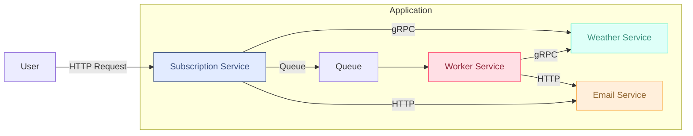

RFC-001: Перехід на мікросервісну архітектуру

## 1. Контекст

Поточна система реалізована як **монолітний застосунок** на Go. Вся бізнес-логіка зосереджена у `subscription_service`, який взаємодіє з іншими внутрішніми сервісами та адаптерами через прямі виклики у межах одного процесу.

### Основні компоненти

- **Core-сервіси:**
    - `subscription_service` — центральна бізнес-логіка підписок
    - `email_service` — генерація та відправка email
    - `weather_service` — отримання погодних даних через chain of providers із кешем
    - `token_service` — перевірка токенів
    - `entities` — сутності: `subscription`, `weather`

- **Адаптери(ключові):**
    - `http_adapter` — приймає HTTP-запити (REST API)
    - `cron` — ініціює регулярні задачі для створення звітів
    - `queue` — черга задач `SendWeatherReport`
    - `worker` — слухає чергу, виконує задачі у goroutine
    - `mail_provider` — (SendGrid) надсилає листи
    - `weather_chain` — зовнішні API провайдерів (OpenWeather, Tomorrow.io)
    - `redis_cache` — кешування відповідей провайдерів
    - `subscription_repo` — доступ до PostgreSQL

### Типові сценарії

1. **Підписка / відписка:**
    - `http_adapter` → `subscription_service` → `token_service`, `subscription_repo`

2. **Періодичне формування звітів:**
    - `cron` → `subscription_service` → `queue`

3. **Обробка задач на надсилання звітів:**
    - `worker` → `subscription_service` → (`weather_service` → `weather_provider`, `email_service` → `email_provider`)

> **примітка:** Погода отримується через ланцюг провайдерів з кешем. Email надсилається через SendGrid.

---

### Діаграма поточної архітектури

Діаграма нижче відображає структуру поточної системи: `core` (включаючи `entities`) є логічним ядром, яке взаємодіє з адаптерами інфраструктури. Всі компоненти працюють як єдиний процес:

## 2. Мотивація

Поточна монолітна архітектура уповільнює розвиток проєкту, ускладнює масштабування та підтримку. Основні проблеми:

- Тісне зчеплення компонентів: усі частини системи пов'язані між собою.
- Неможливість окремого масштабування ресурсомістких частин (email, погода).
- Зовнішні I/O-виклики блокують основний процес.
- Ускладнене тестування та оновлення: кожна зміна вимагає збірки та деплою всього застосунку.
- Вразливість до збоїв: помилка в одному модулі може вплинути на всю систему.

Переваги переходу:

- Розділення відповідальностей між сервісами.
- Можливість незалежного масштабування та деплою.
- Покращення надійності й спостережуваності.
- Зручність у тестуванні й розвитку нових компонентів.

## 3. Пропозиція

Запропоновано перейти до мікросервісної архітектури з поетапним виділенням окремих компонентів, починаючи з найбільш ізольованих і навантажених.

### Принципи

- Кожен сервіс має чітку відповідальність.
- Комунікація між сервісами відбувається через HTTP/gRPC або асинхронну чергу.
- Всі сервіси зберігають свої контракти стабільними, навіть при зміні внутрішньої реалізації.

### Сервіси, які планується виділити:

1. **Weather Service**
    - Відповідає за отримання прогнозу погоди.
    - Має власний ланцюг провайдерів із кешем.
    - Використовуватиме gRPC для внутрішньої взаємодії.

2. **Email Service**
    - Генерує та надсилає email-звіти.
    - Взаємодіє з зовнішнім сервісом (наприклад, SendGrid) через адаптер.
    - Викликатиметься через HTTP.

3. **Worker Service**
    - Асинхронно обробляє задачі з черги (`SendWeatherReport`).
    - Замість goroutine в межах одного процесу працює як окремий процес/сервіс.
    - Отримує задачі через чергу (наприклад, Redis або SQS).
    - Для обробки звертається до `weather_service` та `email_service`.

### Subscription Service

Залишається центральним координатором:
- Приймає запити з HTTP-інтерфейсу.
- Керує підписками (створення, видалення).
- Публікує події у чергу для формування звітів.
- Не виконує важких I/O-операцій безпосередньо.

### Типи комунікації

| Взаємодія                 | Протокол      |
|---------------------------|---------------|
| Subscription → Weather    | gRPC          |
| Subscription → Email      | HTTP          |
| Subscription → Queue      | Asynchronous  |
| Worker → Weather          | gRPC          |
| Worker → Email            | HTTP          |

### Схема мікросервісної взаємодії (спрощено)

Нижче показано основні сервіси та напрямки їх взаємодії.  
Користувач надсилає HTTP-запит до Subscription-сервісу.  
Він далі викликає інші сервіси синхронно (`gRPC`, `HTTP`) або публікує задачі в чергу для асинхронної обробки воркером.

