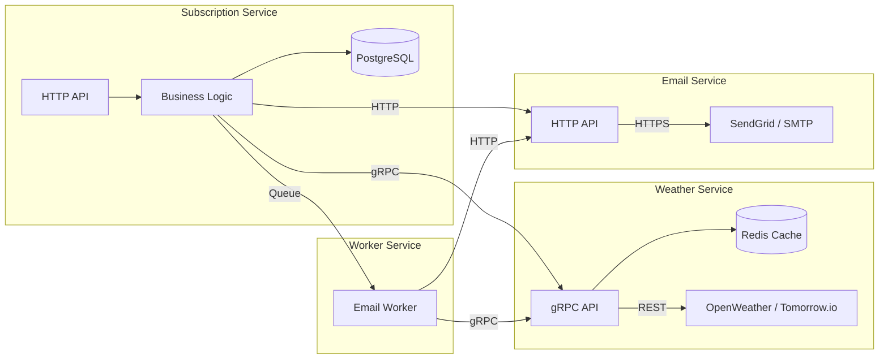

```mermaid
flowchart LR
  %% Subscription Service
  subgraph "Subscription Service"
    SUB_API[HTTP API]
    SUB_SERVICE[Business Logic]
    SUB_DB[(PostgreSQL)]
  end

  %% Worker Service
  subgraph "Worker Service"
    WORKER[Email Worker]
  end

  %% Weather Service
  subgraph "Weather Service"
    WEATHER_API[gRPC API]
    WEATHER_CACHE[(Redis Cache)]
    WEATHER_EXTERNAL[OpenWeather / Tomorrow.io]
  end

  %% Email Service
  subgraph "Email Service"
    EMAIL_API[HTTP API]
    EMAIL_PROVIDER[SendGrid / SMTP]
  end

  %% Connections
  SUB_API --> SUB_SERVICE
  SUB_SERVICE --> SUB_DB
  SUB_SERVICE -->|gRPC| WEATHER_API
  SUB_SERVICE -->|HTTP| EMAIL_API
  SUB_SERVICE -->|Queue| WORKER

  WORKER -->|gRPC| WEATHER_API
  WORKER -->|HTTP| EMAIL_API

  WEATHER_API --> WEATHER_CACHE
  WEATHER_API -->|REST| WEATHER_EXTERNAL

  EMAIL_API -->|HTTPS| EMAIL_PROVIDER
```